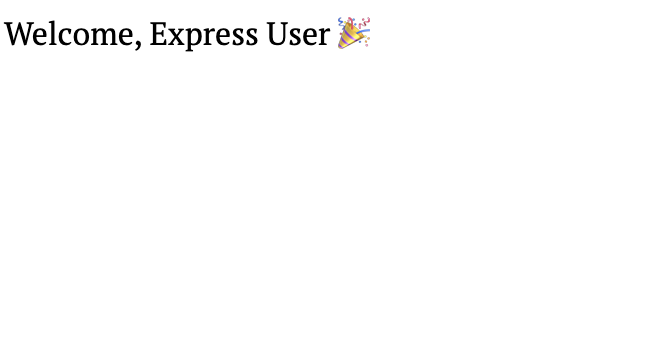

# Handling Different Content Types & Error Handling in Express

## Serving Different Content Types in Express :art:
Express allows you to serve various types of content, including **[HTML](https://developer.mozilla.org/en-US/docs/Web/HTML)**, **[EJS](https://ejs.co/)**, and **[CSS](https://developer.mozilla.org/en-US/docs/Web/CSS)**. Let's explore how to serve these files efficiently by using Express.

### Why Do We Need Static Files?
Static files like CSS, JavaScript, and images make websites look better and work smoothly. CSS adds colors and styles, while JavaScript makes the page interactive. Without them, websites would look plain and not respond to user actions. Express helps serve these files so the website loads correctly and works as expected.

### Serving [Static Files](Glossary.md) (CSS, Images, JS) 
To serve static file such as CSS, JavaScript, and images, use Express's built-in **[`express.static`](https://expressjs.com/en/starter/static-files.html)** **[middleware](https://expressjs.com/en/guide/using-middleware.html)**.

1. Create a `public` folder inside your project and place your static files (e.g., `styles.css`, `script.js`, `images/`)
2. Tell express to use the `public` folder:
```js
const express = require("express");
const app = express();

app.use(express.static("public")); // Serve static files

app.get("/", (req, res) => {
    res.sendFile(__dirname + "/public/index.html");
});

app.listen(3000, () => {
    console.log("Server is running on http://localhost:3000");
});
```

!!! tip 
    Always define your static file directory before routes to avoid conflicts.

Now, your CSS, JavaScript, and image files can be accessed directly in the browser.


<br>

## Using EJS for Dynamic Content
**[EJS (Embedded JavaScript)](https://ejs.co/)** is a template engine that lets you insert dynamic content into HTML. Instead of writing multiple HTML files for different pages, EJS allows you to reuse a single template and pass data to it. This makes your web app more flexible and efficient.<br> First, install EJS by using your console:
```sh 
npm install ejs
```
Then, set up Express to use EJS:
```js
app.set("view engine", "ejs");
```
Create a `views` folder and an `index.ejs` file inside it:
```html
<!DOCTYPE html>
<html>
<head>
    <title>My Express App</title>
    <link rel="stylesheet" href="/styles.css">
</head>
<body>
    <h1>Welcome, <%= name %>🎉</h1>
</body>
</html>
```
Now, modify your route to pass dynamic data:
```js
app.get("/", (req, res) => {
    res.render("index", { name: "Express User"});
})
```
When you visit `http://localhost:3000`, it will display: **Welcome, Express User**   :tada:
!!! success

    <figure markdown="span">
    { width="600" }
    </figure>

<br>

## Error Handling & HTTP Status Code :exclamation:
When handling requests, it's important to return proper **[HTTP status codes](https://developer.mozilla.org/en-US/docs/Web/HTTP/Status)** to indicate success or errors.

### Common HTTP Status Codes
:white_check_mark: `200 OK` - Request was successful <br>
:x: `404 Not Found` - The requested resource does not exist <br>
:no_entry: `500 Internal Server Error` - Something went wrong on the server

### Handling 404 Errors
If a user tries to access a page that doesn't exist, return a **404 response**:
```js
app.use((req, res) => {
    res.status(404).send("404 - Page Not Found");
});
```

### Handling Server Errors
For handling unexpected errors, use an **error-handling middleware**:
```js
app.use((err, req, res, next) => {
    console.error(err.stack);
    res.status(500).send("500 - Internal Server Error");
});
```
!!! note 
    `err`: This represents the error that occurred in the application. Express passes the error to this function when something goes wrong. <br>
    `next`: This allows the function to pass the error to the next middleware in the stack if needed, but in this case, we are handling it directly by sending a response.

!!! danger
    Never expose sensitive information in error messages.

!!! success 
    If you followed the steps, your Express app should now be serving HTML, EJS, CSS, and handling errors correctly.

This page provides a foundation for handling different content types and errors in Express.